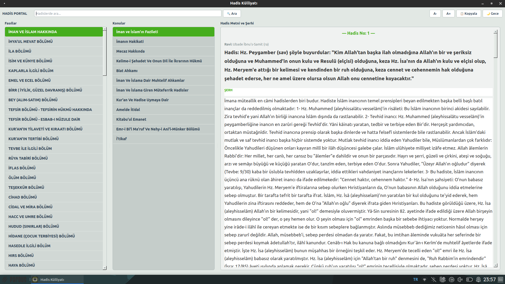

# Kütüb-i Sitte Hadis Rehberi 

Bu uygulama altı büyük hadis kitabından derlenmiş hadisleri içerir.
Sahih-i Buhari, Müslim, Ebu Davut, Tirmizi Nesai ve İbni Mace 

Kaynak: Kütüb-i Sitte Prof. Dr. İbrahim Canan AKÇAĞ YAYINLARI 2012 Toplam Hadis: 5986

Amacım alemlere rahmet Hz Nuhammed (SAV) Efendimizin insanlığa ışık tutan kıymetli sözleri, Linux masaüstü sistemler için hiç bir ticari menfaat gözetmeden tamamen Allah rızası için program haline getirip muhtaç gönüllerin hizmetine sunmaktır.

"Hayra vesile olan yapan gibidir." (Tirmizî, İlm, 14.) 

Kaynak olarak hadiskitaplari.net sitesinde serbest kullanıma açılan Android uygulaması veritabanı kullanılmıştır.  

Debian tabanlı sistemler için .deb dosyası download link: https://github.com/03tekno/hadisler/releases/tag/current

